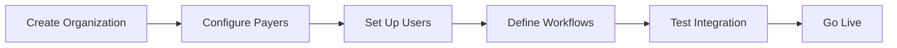

# User Roles Guide - Muni AI RCM Platform

## Overview

The Muni AI RCM Platform implements a sophisticated multi-role system designed to serve different stakeholders in the healthcare revenue cycle. Each role has a tailored experience with specific features, workflows, and permissions.

## Role Types

### 1. Admin Role
**Purpose:** System management, analytics, and platform oversight

**Key Users:**
- RCM Directors
- System Administrators
- Compliance Officers
- IT Management

### 2. Ops Role
**Purpose:** Daily claims processing, review, and exception handling

**Key Users:**
- Medical Coders
- Billing Specialists
- Claims Processors
- QA Reviewers
- Coder - Rework Queue (specialized role for Claim MD rejections)

### 3. Provider Role
**Purpose:** Claim submission, tracking, and financial transparency

**Key Users:**
- Healthcare Providers
- Practice Managers
- Clinical Staff
- Billing Contractors

## Role-Based Features

### Admin Dashboard

#### Overview Section
```typescript
interface AdminDashboard {
  metrics: {
    totalRevenue: number;
    claimVolume: number;
    denialRate: percentage;
    aiAccuracy: percentage;
    avgProcessingTime: hours;
  };
  systemHealth: {
    agentStatus: AgentHealth[];
    apiUsage: APIMetrics;
    errorRates: ErrorTracking;
  };
}
```

#### Key Features

**1. Revenue Analytics**
- Real-time revenue tracking
- Payer mix analysis
- Denial trends and patterns
- Payment velocity metrics

**2. AI Performance Monitoring**
- Agent accuracy metrics
- Confidence score distributions
- Human override tracking
- Model improvement opportunities

**3. User Management**
```typescript
// Admin can manage all users
interface UserManagement {
  createUser(data: UserData): Promise<User>;
  assignRole(userId: string, role: UserRole): Promise<void>;
  suspendUser(userId: string, reason: string): Promise<void>;
  viewAuditLog(userId: string): Promise<AuditEntry[]>;
}
```

**4. System Configuration**
- Payer settings management
- Workflow template configuration
- Agent threshold adjustments
- Integration endpoint management

**5. Compliance Dashboard**
- HIPAA audit trails
- Access pattern analysis
- Security event monitoring
- Compliance report generation

### Ops Dashboard

#### Work Queue Management
```typescript
interface OpsQueue {
  tasks: {
    id: string;
    type: 'review' | 'denial' | 'exception';
    priority: 'high' | 'medium' | 'low';
    assignedTo?: string;
    dueDate: Date;
    claim: ClaimSummary;
  }[];
  filters: {
    priority: string[];
    taskType: string[];
    payer: string[];
    dateRange: DateRange;
  };
}
```

#### Key Features

**1. Intelligent Work Queue**
- Priority-based task sorting
- Smart assignment algorithms
- SLA tracking and alerts
- Bulk action capabilities

**2. AI Review Center**
```typescript
interface AIReview {
  lowConfidenceClaims: {
    claimId: string;
    aiSuggestion: CodeSet;
    confidence: number;
    flaggedReasons: string[];
  }[];
  overrideCapability: {
    updateCodes(claimId: string, codes: CodeSet): Promise<void>;
    addNote(claimId: string, note: string): Promise<void>;
    escalate(claimId: string, reason: string): Promise<void>;
  };
}
```

**3. Denial Management Workflow**
- Categorized denial queues
- Appeal template library
- Documentation collector
- Resubmission tracker

**4. Claim MD Rework Queue**
- Specialized queue for claims rejected by Claim MD validation
- AI-analyzed rejection errors with suggested corrections
- Quick-fix interface for common validation issues
- Resubmission tracking with retry count monitoring

**5. Quality Assurance Tools**
- Random audit selection
- Coding accuracy reports
- Training need identification
- Performance scorecards

**6. Batch Operations**
- Mass claim resubmission
- Bulk status updates
- Group reassignment
- Export capabilities

### Provider Dashboard

#### Claim Submission Interface
```typescript
interface ProviderSubmission {
  ehrPaste: {
    parseClinicalnotes(text: string): Promise<StructuredData>;
    suggestCodes(data: StructuredData): Promise<CodeSuggestions>;
  };
  guidedWorkflow: {
    currentStep: WorkflowStep;
    progress: percentage;
    nextAction: string;
    estimatedTime: minutes;
  };
}
```

#### Key Features

**1. EHR Data Paste**
- Smart text parsing
- Automatic field mapping
- Validation feedback
- Missing data prompts

**Example Workflow:**
```typescript
// Provider pastes clinical note
const clinicalText = `
Patient: John Doe, DOB: 01/15/1980
Visit Date: 12/01/2024
Chief Complaint: Chronic lower back pain
Assessment: Lumbar radiculopathy
Plan: MRI lumbar spine, PT referral
`;

// System automatically extracts
const extracted = {
  patient: { name: "John Doe", dob: "1980-01-15" },
  visitDate: "2024-12-01",
  diagnoses: ["M54.16"],
  procedures: ["72148"],
  referrals: ["Physical Therapy"]
};
```

**2. Guided Claim Workflow**

Step-by-step autonomous processing:

```typescript
enum WorkflowSteps {
  DATA_ENTRY = "Enter Patient Information",
  ELIGIBILITY = "Verify Insurance Coverage",
  CODING = "Generate Medical Codes",
  REVIEW = "Review AI Suggestions",
  ESTIMATION = "Calculate Patient Cost",
  SUBMISSION = "Submit to Payer"
}

interface WorkflowState {
  currentStep: WorkflowSteps;
  completedSteps: WorkflowSteps[];
  blockingIssues?: string[];
  estimatedCompletion: Date;
}
```

**3. Real-Time Transparency**
- Live claim status tracking
- Payment timeline visualization
- Denial reason explanations
- Expected reimbursement display

**4. Financial Dashboard**
```typescript
interface ProviderFinancials {
  metrics: {
    submittedThisMonth: Money;
    collectedThisMonth: Money;
    outstandingClaims: Money;
    averageDaysToPayment: number;
  };
  claimBreakdown: {
    status: 'submitted' | 'processing' | 'paid' | 'denied';
    count: number;
    totalValue: Money;
  }[];
}
```

**5. Performance Insights**
- Personal efficiency metrics
- AI suggestion accuracy
- Common denial reasons
- Optimization recommendations

## Role-Based Workflows

### Admin Workflows

**1. New Organization Onboarding**


**2. Compliance Audit**
- Generate access reports
- Review PHI handling
- Validate security controls
- Document findings

### Ops Workflows

**1. Low-Confidence Claim Review**
```typescript
async function reviewLowConfidenceClaim(claimId: string) {
  // 1. Fetch claim details and AI suggestion
  const claim = await getClaim(claimId);
  const aiSuggestion = await getAISuggestion(claimId);
  
  // 2. Review clinical documentation
  const documentation = await getClinicalDocs(claim.patientId);
  
  // 3. Make decision
  if (agreeWithAI) {
    await approveSuggestion(claimId);
  } else {
    await overrideCodes(claimId, correctedCodes);
    await logOverrideReason(claimId, reason);
  }
  
  // 4. Update training data
  await updateMLFeedback(claimId, finalCodes);
}
```

**2. Claim MD Rejection Workflow**
```typescript
async function handleClaimMDRejection(claimId: string) {
  // 1. Fetch rejection details from Claim MD webhook
  const rejection = await getClaimMDRejection(claimId);
  
  // 2. AI analyzes rejection errors
  const aiAnalysis = await analyzeRejectionErrors(rejection.errors);
  
  // 3. Present corrections to coder
  const corrections = {
    missingFields: aiAnalysis.missingFields,
    invalidCodes: aiAnalysis.invalidCodes,
    formattingIssues: aiAnalysis.formattingIssues
  };
  
  // 4. Apply corrections and resubmit
  await applyCorrections(claimId, corrections);
  await resubmitToClaimMD(claimId);
}
```

**3. Denial Appeal Process**
- Analyze payer denial reason (after successful Claim MD submission)
- Gather supporting documentation
- Generate appeal letter
- Track appeal status
- Log outcome for learning

### Provider Workflows

**1. New Claim Submission**
```typescript
interface ClaimSubmissionFlow {
  steps: [
    { id: 1, name: "Paste EHR Data", status: "complete" },
    { id: 2, name: "Verify Patient Info", status: "complete" },
    { id: 3, name: "Check Eligibility", status: "in-progress" },
    { id: 4, name: "AI Code Generation", status: "pending" },
    { id: 5, name: "Review & Approve", status: "pending" },
    { id: 6, name: "Submit Claim", status: "pending" }
  ];
}
```

**2. Claim Status Check**
- Real-time status updates
- Payment tracking
- Denial notifications
- Next action guidance

## Permission Matrix

| Feature | Admin | Ops | Provider |
|---------|-------|-----|----------|
| View All Claims | ✓ | ✓ | Own Only |
| Override AI Codes | ✓ | ✓ | ✗ |
| Submit Claims | ✓ | ✓ | ✓ |
| View Financial Reports | ✓ | Limited | Own Only |
| Manage Users | ✓ | ✗ | ✗ |
| Configure Workflows | ✓ | ✗ | ✗ |
| Access Audit Logs | ✓ | Limited | ✗ |
| Bulk Operations | ✓ | ✓ | ✗ |
| View AI Metrics | ✓ | ✓ | Limited |
| Export Data | ✓ | ✓ | Own Only |
| Fix Claim MD Rejections | ✓ | ✓ | ✗ |

## Role-Specific UI Components

### Admin Components
```typescript
// System health monitoring
<SystemHealthWidget />
<RevenueAnalytics />
<UserActivityFeed />
<ComplianceAlerts />
```

### Ops Components
```typescript
// Work queue management
<PriorityTaskQueue />
<AIReviewPanel />
<ClaimMDReworkQueue />
<DenialWorkbench />
<QualityMetrics />
```

### Provider Components
```typescript
// Claim submission
<EHRPasteBox />
<GuidedWorkflow />
<ClaimTracker />
<FinancialSummary />
```

## Implementation Details

### Role Detection
```typescript
// lib/auth-utils.ts
export async function getUserRole(): Promise<UserRole> {
  const session = await auth();
  const user = await getUserProfile(session.userId);
  
  // Check Cognito groups
  if (user.groups.includes('Admins')) return 'admin';
  if (user.groups.includes('Operations')) return 'ops';
  if (user.groups.includes('Providers')) return 'provider';
  
  // Default fallback
  return 'provider';
}
```

### Dynamic Dashboard Loading
```typescript
// app/dashboard/page.tsx
export default async function DashboardPage() {
  const role = await getUserRole();
  
  switch(role) {
    case 'admin':
      return <AdminDashboard />;
    case 'ops':
      return <OpsDashboard />;
    case 'provider':
      return <ProviderDashboard />;
    default:
      return <AccessDenied />;
  }
}
```

### Role-Based Data Access
```typescript
// lib/data-access.ts
export async function getClaims(userId: string, role: UserRole) {
  const baseQuery = {
    include: ['patient', 'codes', 'status']
  };
  
  // Apply role-based filters
  if (role === 'provider') {
    baseQuery.where = { providerId: userId };
  } else if (role === 'ops') {
    baseQuery.where = { status: ['review', 'denied'] };
  }
  // Admin sees all
  
  return await db.claims.findMany(baseQuery);
}
```

## Best Practices

### For Admins
1. Regular review of AI performance metrics
2. Monitor user activity for anomalies
3. Keep workflow templates updated
4. Schedule regular compliance audits

### For Ops Users
1. Prioritize high-value claims
2. Document override reasons clearly
3. Identify patterns in denials
4. Contribute to training data quality
5. Focus on Claim MD rejections for quick resolution
6. Learn common validation errors to prevent future rejections

### For Providers
1. Provide complete clinical documentation
2. Review AI suggestions carefully
3. Track claim status regularly
4. Use batch submission for efficiency

## Testing Different Roles

During development, you can test different roles:

```typescript
// lib/auth-utils.ts (development only)
export function getUserRole(): UserRole {
  if (process.env.NODE_ENV === 'development') {
    // Change this to test different roles
    return 'admin'; // or 'ops' or 'provider'
  }
  // Production logic
  return getActualUserRole();
}
```

## Summary

The multi-role system in Muni AI RCM provides:
- **Tailored experiences** for each user type
- **Efficient workflows** with AI assistance
- **Appropriate permissions** for security
- **Transparency** throughout the revenue cycle
- **Continuous improvement** through feedback loops

Each role contributes to the overall efficiency of the revenue cycle while maintaining security and compliance standards.