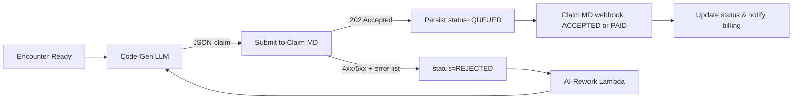

# Workflow System - Muni AI RCM Platform

## Overview

The Muni AI RCM Platform implements a sophisticated **guided workflow system** that provides autonomous, step-by-step guidance through complex revenue cycle processes. Inspired by Devin-like autonomous experiences, the system breaks down complex tasks into manageable steps while maintaining transparency and user control.

## Workflow Timing & Triggers

The RCM platform operates on different timing cycles based on the workflow type:

### Pre-Encounter Workflows (T-2 days)
- **Eligibility Verification**: Automatically triggered 48 hours before scheduled appointments
- **Prior Authorization**: Initiated when eligibility check identifies auth requirements
- **Patient Communication**: Outreach for coverage issues or payment arrangements

### Post-Encounter Workflows (T+0 to T+1 day)
- **Claim Creation**: Ops team monitors and extracts completed encounters daily
- **Coding & Submission**: Process claims within 24 hours of encounter completion
- **Quality Review**: Real-time review of AI-generated codes

### Follow-up Workflows (T+14 to T+30 days)
- **Payment Posting**: Process ERAs as received from payers
- **Denial Management**: Handle denials within 48 hours of receipt
- **Appeals**: Submit appeals within payer-specific timelines

## Core Workflow Principles

### 1. **Autonomous Guidance**
- AI-powered step progression
- Intelligent task prioritization
- Automatic dependency resolution
- Predictive next-action suggestions

### 2. **Transparency & Control**
- Real-time progress tracking
- Clear step descriptions and rationale
- User override capabilities
- Audit trail for all decisions

### 3. **Role-Based Adaptation**
- Workflows adapt to user roles (Admin/Ops/Provider)
- Skill-level appropriate complexity
- Permission-aware step availability
- Personalized experience optimization

### 4. **Error Recovery**
- Automatic error detection and handling
- Smart retry mechanisms
- Alternative path suggestions
- Human escalation triggers

## Workflow Architecture

### Workflow State Machine

```typescript
interface WorkflowState {
  id: string;
  claimId: string;
  type: WorkflowType;
  currentStep: WorkflowStep;
  completedSteps: WorkflowStep[];
  availableSteps: WorkflowStep[];
  blockedSteps: WorkflowStep[];
  userContext: {
    userId: string;
    role: UserRole;
    skillLevel: 'beginner' | 'intermediate' | 'expert';
    preferences: WorkflowPreferences;
  };
  progress: {
    percentage: number;
    estimatedTimeRemaining: number;
    estimatedCompletion: Date;
  };
  metadata: {
    startedAt: Date;
    lastActivity: Date;
    pausedDuration: number;
    userInteractions: WorkflowInteraction[];
  };
}

interface WorkflowStep {
  id: string;
  name: string;
  description: string;
  type: 'automated' | 'human_review' | 'user_input' | 'approval';
  status: 'pending' | 'in_progress' | 'completed' | 'failed' | 'skipped';
  dependencies: string[];
  estimatedDuration: number;
  requiredRole?: UserRole;
  agentInvolved?: string;
  data: Record<string, any>;
  validationRules: ValidationRule[];
  nextSteps: string[];
}
```

### Workflow Engine

```typescript
class WorkflowEngine {
  async startWorkflow(
    type: WorkflowType, 
    context: WorkflowContext
  ): Promise<WorkflowState> {
    // 1. Load workflow template
    const template = await this.getWorkflowTemplate(type);
    
    // 2. Customize for user context
    const customizedSteps = await this.customizeWorkflow(template, context);
    
    // 3. Initialize state
    const workflowState = await this.initializeWorkflowState({
      type,
      steps: customizedSteps,
      context
    });
    
    // 4. Start first step
    await this.progressToNextStep(workflowState);
    
    return workflowState;
  }

  async progressWorkflow(
    workflowId: string, 
    stepResult: StepResult
  ): Promise<WorkflowState> {
    const state = await this.getWorkflowState(workflowId);
    
    // 1. Validate step completion
    await this.validateStepCompletion(state.currentStep, stepResult);
    
    // 2. Update state
    await this.updateWorkflowState(state, stepResult);
    
    // 3. Determine next steps
    const nextSteps = await this.determineNextSteps(state);
    
    // 4. Auto-progress if possible
    if (nextSteps.length === 1 && nextSteps[0].type === 'automated') {
      return await this.executeAutomatedStep(state, nextSteps[0]);
    }
    
    return state;
  }

  private async executeAutomatedStep(
    state: WorkflowState, 
    step: WorkflowStep
  ): Promise<WorkflowState> {
    try {
      // Execute agent or automation
      const result = await this.executeStepLogic(step, state);
      
      // Auto-progress if successful
      return await this.progressWorkflow(state.id, result);
    } catch (error) {
      // Handle automation failure
      return await this.handleStepFailure(state, step, error);
    }
  }
}
```

## Core Workflow Types

### 1. Pre-Encounter Eligibility Workflow

Verifies insurance eligibility 2 days before scheduled appointments to ensure coverage.

```typescript
const preEncounterEligibilityWorkflow: WorkflowTemplate = {
  id: 'pre-encounter-eligibility',
  name: 'Pre-Encounter Insurance Verification',
  description: 'Verify insurance eligibility 48 hours before scheduled appointments',
  estimatedDuration: 10, // minutes
  trigger: 'scheduled', // Runs automatically 2 days before appointment
  steps: [
    {
      id: 'appointment-check',
      name: 'Check Upcoming Appointments',
      description: 'Identify appointments scheduled for 2 days from now',
      type: 'automated',
      guidance: {
        title: 'Scanning Appointments',
        instructions: 'System is checking for appointments scheduled in 48 hours...',
        automation: 'Pulls appointment data from EHR via ops team remote access'
      }
    },
    {
      id: 'patient-insurance-lookup',
      name: 'Retrieve Patient Insurance Info',
      description: 'Get current insurance information from patient record',
      type: 'automated',
      dependencies: ['appointment-check'],
      guidance: {
        title: 'Looking Up Insurance',
        instructions: 'Retrieving patient insurance details from EHR...'
      }
    },
    {
      id: 'eligibility-verification',
      name: 'Verify Insurance Eligibility',
      description: 'Check eligibility with payer via Claim MD',
      type: 'automated',
      dependencies: ['patient-insurance-lookup'],
      agent: 'EligibilityAgent',
      guidance: {
        title: 'Verifying Coverage',
        instructions: 'Sending 270 eligibility request to payer via Claim MD...',
        automation: 'EligibilityAgent sends real-time eligibility check'
      }
    },
    {
      id: 'eligibility-review',
      name: 'Review Eligibility Results',
      description: 'Review coverage details and flag any issues',
      type: 'human_review',
      dependencies: ['eligibility-verification'],
      requiredRole: ['ops'],
      guidance: {
        title: 'Review Coverage Status',
        instructions: 'Check eligibility response for any issues that need attention',
        reviewPoints: [
          'Verify coverage is active',
          'Check if prior authorization needed',
          'Note copay/deductible amounts',
          'Flag any coverage limitations'
        ]
      }
    },
    {
      id: 'patient-notification',
      name: 'Notify About Coverage Issues',
      description: 'Contact patient if coverage issues found',
      type: 'user_input',
      dependencies: ['eligibility-review'],
      condition: (state) => state.data.eligibilityIssues === true,
      guidance: {
        title: 'Patient Communication',
        instructions: 'Contact patient about coverage issues before appointment',
        actions: [
          'Inform about inactive coverage',
          'Discuss prior authorization needs',
          'Provide cost estimates',
          'Offer payment options'
        ]
      }
    }
  ]
};
```

### 2. New Claim Submission Workflow

The primary workflow for submitting new claims with full AI assistance and Claim MD integration.

```typescript
const newClaimWorkflow: WorkflowTemplate = {
  id: 'new-claim-submission',
  name: 'New Claim Submission',
  description: 'Complete workflow for submitting a new medical claim',
  estimatedDuration: 30, // minutes
  steps: [
    {
      id: 'encounter-extraction',
      name: 'Extract Encounter Data',
      description: 'Ops team extracts completed encounter from EHR',
      type: 'user_input',
      requiredRole: ['ops'],
      validation: [
        { field: 'patientInfo', required: true },
        { field: 'visitDate', required: true },
        { field: 'clinicalNotes', minLength: 50 }
      ],
      guidance: {
        title: 'Extract Encounter Information',
        instructions: 'Access client EHR via remote connection and extract encounter data',
        steps: [
          'Log into client EHR system',
          'Navigate to completed encounters',
          'Extract patient demographics',
          'Copy clinical notes and diagnoses',
          'Gather procedure/service information'
        ]
      }
    },
    {
      id: 'patient-verification',
      name: 'Patient Information Verification',
      description: 'Review and verify extracted patient information',
      type: 'human_review',
      dependencies: ['encounter-extraction'],
      agent: 'EHRParsingAgent',
      guidance: {
        title: 'Verify Patient Information',
        instructions: 'Review the automatically extracted patient information for accuracy.',
        checks: [
          'Patient name matches exactly',
          'Date of birth is correct',
          'Insurance information is current'
        ]
      }
    },
    {
      id: 'eligibility-confirmation',
      name: 'Confirm Pre-Verified Eligibility',
      description: 'Confirm eligibility was verified before encounter',
      type: 'human_review',
      dependencies: ['patient-verification'],
      guidance: {
        title: 'Confirm Insurance Status',
        instructions: 'Verify that eligibility was checked 2 days prior to encounter',
        checks: [
          'Eligibility was verified pre-encounter',
          'Coverage is still active',
          'No changes to insurance since verification',
          'Prior authorizations obtained if needed'
        ]
      }
    },
    {
      id: 'ai-coding',
      name: 'AI Code Generation',
      description: 'Generate medical codes using AI analysis',
      type: 'automated',
      dependencies: ['eligibility-confirmation'],
      agent: 'CodingAgent',
      guidance: {
        title: 'Generating Medical Codes',
        instructions: 'AI is analyzing clinical documentation to suggest appropriate medical codes...',
        automation: 'CodingAgent will generate CPT, ICD-10, and HCPCS codes based on clinical notes'
      }
    },
    {
      id: 'code-review',
      name: 'Review AI-Generated Codes',
      description: 'Review and approve AI-suggested medical codes',
      type: 'human_review',
      dependencies: ['ai-coding'],
      requiredRole: ['admin', 'ops'],
      guidance: {
        title: 'Review Medical Codes',
        instructions: 'Review the AI-suggested codes for accuracy and completeness.',
        reviewCriteria: [
          'Codes match documented services',
          'Diagnosis codes support procedures',
          'Modifiers are appropriate',
          'Units and quantities are correct'
        ]
      }
    },
    {
      id: 'cost-estimation',
      name: 'Patient Cost Estimation',
      description: 'Calculate estimated patient out-of-pocket costs',
      type: 'automated',
      dependencies: ['code-review'],
      agent: 'PatientEstimatorAgent',
      guidance: {
        title: 'Calculating Patient Costs',
        instructions: 'Computing patient responsibility based on insurance benefits...',
        automation: 'PatientEstimatorAgent calculates copay, deductible, and coinsurance'
      }
    },
    {
      id: 'final-review',
      name: 'Final Claim Review',
      description: 'Comprehensive review before submission',
      type: 'human_review',
      dependencies: ['cost-estimation'],
      guidance: {
        title: 'Final Claim Review',
        instructions: 'Perform final review of all claim components before submission.',
        checklist: [
          'All patient information is accurate',
          'Medical codes are correct and complete',
          'Insurance information is current',
          'Patient cost estimate is reasonable',
          'All required documentation is attached'
        ]
      }
    },
    {
      id: 'claim-submission',
      name: 'Submit Claim to Claim MD',
      description: 'Submit JSON claim payload to Claim MD API',
      type: 'automated',
      dependencies: ['final-review'],
      agent: 'SubmitClaimAgent',
      guidance: {
        title: 'Submitting Claim',
        instructions: 'Submitting JSON claim data to Claim MD for validation and payer submission...',
        automation: 'SubmitClaimAgent sends claim to Claim MD API which handles X12 generation'
      }
    },
    {
      id: 'confirmation',
      name: 'Submission Confirmation',
      description: 'Confirm successful claim submission',
      type: 'human_review',
      dependencies: ['claim-submission'],
      guidance: {
        title: 'Claim Submitted Successfully',
        instructions: 'Your claim has been submitted. Track progress in the claims dashboard.',
        nextSteps: [
          'Monitor Claim MD status updates via webhook',
          'Follow up if no response in 14 days',
          'Handle any rejections from Claim MD validation'
        ]
      }
    }
  ]
};
```

### 3. Claim MD Rejection Workflow

Workflow for handling claims rejected by Claim MD validation.



```typescript
const claimMDRejectionWorkflow: WorkflowTemplate = {
  id: 'claimmd-rejection',
  name: 'Claim MD Rejection Handler',
  description: 'Handle claims rejected by Claim MD validation',
  estimatedDuration: 20, // minutes
  trigger: 'webhook', // Triggered by Claim MD rejection webhook
  steps: [
    {
      id: 'analyze-rejection',
      name: 'Analyze Rejection Errors',
      description: 'AI analyzes Claim MD rejection errors',
      type: 'automated',
      agent: 'RejectionAnalyzerAgent',
      guidance: {
        title: 'Analyzing Rejection',
        instructions: 'AI is analyzing Claim MD validation errors to determine corrections needed...',
        automation: 'RejectionAnalyzerAgent parses error codes and suggests fixes'
      }
    },
    {
      id: 'review-corrections',
      name: 'Review AI Corrections',
      description: 'Review AI-suggested corrections to claim',
      type: 'human_review',
      dependencies: ['analyze-rejection'],
      requiredRole: ['ops'],
      guidance: {
        title: 'Review Claim Corrections',
        instructions: 'Review the AI-suggested corrections based on Claim MD errors.',
        errorTypes: [
          'Missing required fields',
          'Invalid code combinations',
          'Payer-specific formatting issues',
          'Authorization requirements'
        ]
      }
    },
    {
      id: 'apply-corrections',
      name: 'Apply Corrections',
      description: 'Apply approved corrections to claim',
      type: 'automated',
      dependencies: ['review-corrections'],
      guidance: {
        title: 'Applying Corrections',
        instructions: 'Updating claim with approved corrections...',
        automation: 'System updates claim fields based on corrections'
      }
    },
    {
      id: 'resubmit-claim',
      name: 'Resubmit to Claim MD',
      description: 'Resubmit corrected claim to Claim MD',
      type: 'automated',
      dependencies: ['apply-corrections'],
      agent: 'SubmitClaimAgent',
      guidance: {
        title: 'Resubmitting Claim',
        instructions: 'Resubmitting corrected claim to Claim MD API...',
        automation: 'SubmitClaimAgent resubmits with incremented retry count'
      }
    }
  ]
};
```

### 4. Denial Management Workflow

Comprehensive workflow for handling payer denials after successful Claim MD submission.

```typescript
const denialManagementWorkflow: WorkflowTemplate = {
  id: 'denial-management',
  name: 'Claim Denial Management',
  description: 'Workflow for handling denied claims and generating appeals',
  estimatedDuration: 45, // minutes
  steps: [
    {
      id: 'denial-analysis',
      name: 'Analyze Denial Reason',
      description: 'AI analysis of denial codes and reasons',
      type: 'automated',
      agent: 'DenialClassifierAgent',
      guidance: {
        title: 'Analyzing Denial',
        instructions: 'AI is analyzing the denial reason and determining best course of action...',
        automation: 'DenialClassifierAgent categorizes denial and suggests response strategy'
      }
    },
    {
      id: 'strategy-review',
      name: 'Review Appeal Strategy',
      description: 'Review AI-recommended appeal strategy',
      type: 'human_review',
      dependencies: ['denial-analysis'],
      guidance: {
        title: 'Review Appeal Strategy',
        instructions: 'Review the AI-recommended approach for this denial.',
        options: [
          'Correct and resubmit',
          'Submit formal appeal',
          'Request additional documentation',
          'Write off as uncollectible'
        ]
      }
    },
    {
      id: 'documentation-gathering',
      name: 'Gather Supporting Documentation',
      description: 'Collect additional documentation for appeal',
      type: 'user_input',
      dependencies: ['strategy-review'],
      condition: (state) => state.data.appealStrategy.requiresDocumentation,
      guidance: {
        title: 'Gather Supporting Documents',
        instructions: 'Collect the following documentation to support your appeal:',
        requirements: 'Generated dynamically based on denial reason'
      }
    },
    {
      id: 'appeal-generation',
      name: 'Generate Appeal Letter',
      description: 'AI-generated professional appeal letter',
      type: 'automated',
      dependencies: ['documentation-gathering'],
      agent: 'AppealLetterAgent',
      guidance: {
        title: 'Generating Appeal Letter',
        instructions: 'Creating professional appeal letter based on denial analysis...',
        automation: 'AppealLetterAgent drafts compelling, evidence-based appeal'
      }
    },
    {
      id: 'appeal-review',
      name: 'Review Appeal Letter',
      description: 'Review and edit generated appeal letter',
      type: 'human_review',
      dependencies: ['appeal-generation'],
      guidance: {
        title: 'Review Appeal Letter',
        instructions: 'Review the generated appeal letter and make any necessary edits.',
        tips: [
          'Ensure all relevant facts are included',
          'Verify medical necessity is clearly stated',
          'Check that policy citations are accurate'
        ]
      }
    },
    {
      id: 'appeal-submission',
      name: 'Submit Appeal',
      description: 'Submit appeal to payer',
      type: 'automated',
      dependencies: ['appeal-review'],
      guidance: {
        title: 'Submitting Appeal',
        instructions: 'Submitting appeal package to payer...',
        automation: 'System submits appeal via Claim MD appropriate channel'
      }
    }
  ]
};
```

### 5. Quality Review Workflow

Workflow for reviewing low-confidence AI predictions and training data.

```typescript
const qualityReviewWorkflow: WorkflowTemplate = {
  id: 'quality-review',
  name: 'AI Quality Review',
  description: 'Review and validate low-confidence AI predictions',
  estimatedDuration: 15, // minutes
  availableRoles: ['admin', 'ops'],
  steps: [
    {
      id: 'case-selection',
      name: 'Select Review Case',
      description: 'Select a case requiring quality review',
      type: 'user_input',
      guidance: {
        title: 'Select Case for Review',
        instructions: 'Choose a case from the quality review queue.',
        filters: [
          'Confidence score < 0.8',
          'Flagged by previous reviewers',
          'Contains unusual patterns'
        ]
      }
    },
    {
      id: 'ai-analysis-review',
      name: 'Review AI Analysis',
      description: 'Examine AI reasoning and confidence factors',
      type: 'human_review',
      dependencies: ['case-selection'],
      guidance: {
        title: 'Review AI Analysis',
        instructions: 'Examine how the AI analyzed this case and why confidence was low.',
        focus: [
          'Review AI reasoning chain',
          'Identify confidence factors',
          'Check for data quality issues'
        ]
      }
    },
    {
      id: 'expert-validation',
      name: 'Expert Code Validation',
      description: 'Validate or correct AI-suggested codes',
      type: 'human_review',
      dependencies: ['ai-analysis-review'],
      requiredRole: ['admin', 'ops'],
      guidance: {
        title: 'Validate Medical Codes',
        instructions: 'Review and validate or correct the AI-suggested medical codes.',
        validation: [
          'Check codes against clinical documentation',
          'Verify code combinations are valid',
          'Ensure compliance with payer policies'
        ]
      }
    },
    {
      id: 'feedback-recording',
      name: 'Record Training Feedback',
      description: 'Document corrections for AI training',
      type: 'automated',
      dependencies: ['expert-validation'],
      guidance: {
        title: 'Recording Feedback',
        instructions: 'Storing your corrections to improve AI performance...',
        automation: 'System records feedback for future model training'
      }
    }
  ]
};
```

## Workflow Components

### React Components for Workflow Steps

```tsx
// Core workflow component
interface WorkflowComponentProps {
  workflowState: WorkflowState;
  currentStep: WorkflowStep;
  onStepComplete: (result: StepResult) => Promise<void>;
  onStepSkip?: () => Promise<void>;
}

export function WorkflowStep({ 
  workflowState, 
  currentStep, 
  onStepComplete 
}: WorkflowComponentProps) {
  const [isProcessing, setIsProcessing] = useState(false);
  const [stepData, setStepData] = useState(currentStep.data);

  const handleSubmit = async (data: any) => {
    setIsProcessing(true);
    try {
      await onStepComplete({
        stepId: currentStep.id,
        status: 'completed',
        data,
        timestamp: new Date()
      });
    } catch (error) {
      console.error('Step completion failed:', error);
    } finally {
      setIsProcessing(false);
    }
  };

  return (
    <div className="workflow-step">
      <WorkflowProgress 
        current={workflowState.progress.percentage} 
        total={100} 
      />
      
      <StepHeader step={currentStep} />
      
      <StepGuidance guidance={currentStep.guidance} />
      
      <StepContent 
        step={currentStep}
        data={stepData}
        onDataChange={setStepData}
        onSubmit={handleSubmit}
        isProcessing={isProcessing}
      />
      
      <StepActions 
        step={currentStep}
        canSkip={currentStep.optional}
        onSubmit={handleSubmit}
        onSkip={onStepSkip}
        isProcessing={isProcessing}
      />
    </div>
  );
}
```

### EHR Data Paste Component

```tsx
export function EHRDataPasteComponent({ onDataExtracted }: {
  onDataExtracted: (data: ExtractedClinicalData) => void;
}) {
  const [rawText, setRawText] = useState('');
  const [isProcessing, setIsProcessing] = useState(false);
  const [extractedData, setExtractedData] = useState<ExtractedClinicalData | null>(null);

  const handlePaste = async () => {
    setIsProcessing(true);
    try {
      const result = await processEHRData(rawText);
      if (result.success) {
        setExtractedData(result.extractedData);
        onDataExtracted(result.extractedData);
      }
    } catch (error) {
      console.error('EHR processing failed:', error);
    } finally {
      setIsProcessing(false);
    }
  };

  return (
    <div className="ehr-paste-component">
      <div className="input-section">
        <label htmlFor="ehr-text">Paste Clinical Notes</label>
        <textarea
          id="ehr-text"
          value={rawText}
          onChange={(e) => setRawText(e.target.value)}
          placeholder="Paste clinical notes from your EHR system here..."
          rows={10}
          className="ehr-textarea"
        />
        <button 
          onClick={handlePaste}
          disabled={!rawText.trim() || isProcessing}
          className="process-button"
        >
          {isProcessing ? 'Processing...' : 'Extract Information'}
        </button>
      </div>

      {extractedData && (
        <div className="extracted-data">
          <h3>Extracted Information</h3>
          <PatientInfoCard data={extractedData.patient} />
          <VisitInfoCard data={extractedData.visit} />
          <DiagnosisCodesCard codes={extractedData.diagnosis} />
          <ProcedureCodesCard codes={extractedData.procedures} />
          
          <div className="confidence-indicator">
            Extraction Confidence: {(extractedData.confidence * 100).toFixed(1)}%
          </div>
        </div>
      )}
    </div>
  );
}
```

### AI Review Component

```tsx
export function AIReviewComponent({ 
  aiResult, 
  onReviewComplete 
}: {
  aiResult: AIGeneratedResult;
  onReviewComplete: (review: ReviewResult) => void;
}) {
  const [approvedCodes, setApprovedCodes] = useState(aiResult.codes);
  const [reviewNotes, setReviewNotes] = useState('');
  const [confidence, setConfidence] = useState(aiResult.confidence);

  const handleApprove = () => {
    onReviewComplete({
      approved: true,
      codes: approvedCodes,
      confidence,
      reviewNotes,
      reviewer: getCurrentUser().id
    });
  };

  const handleReject = () => {
    onReviewComplete({
      approved: false,
      originalCodes: aiResult.codes,
      correctedCodes: approvedCodes,
      reviewNotes,
      reviewer: getCurrentUser().id
    });
  };

  return (
    <div className="ai-review-component">
      <div className="ai-analysis">
        <h3>AI Analysis</h3>
        <div className="confidence-score">
          Confidence: {(aiResult.confidence * 100).toFixed(1)}%
        </div>
        <div className="ai-reasoning">
          <strong>Reasoning:</strong> {aiResult.reasoning}
        </div>
      </div>

      <div className="code-review">
        <h3>Generated Codes</h3>
        <CodeReviewTable 
          codes={aiResult.codes}
          onCodesChange={setApprovedCodes}
          editable={true}
        />
      </div>

      <div className="review-actions">
        <textarea
          value={reviewNotes}
          onChange={(e) => setReviewNotes(e.target.value)}
          placeholder="Add review notes (optional)..."
          rows={3}
        />
        
        <div className="action-buttons">
          <button 
            onClick={handleApprove}
            className="approve-button"
          >
            Approve Codes
          </button>
          <button 
            onClick={handleReject}
            className="reject-button"
          >
            Reject & Correct
          </button>
        </div>
      </div>
    </div>
  );
}
```

## Workflow Automation

### Smart Step Progression

```typescript
class WorkflowAutomation {
  async determineNextSteps(state: WorkflowState): Promise<WorkflowStep[]> {
    const currentStep = state.currentStep;
    const template = await this.getWorkflowTemplate(state.type);
    
    // Get potential next steps from template
    const candidateSteps = template.steps.filter(step => 
      currentStep.nextSteps.includes(step.id)
    );

    // Filter based on conditions
    const availableSteps = await Promise.all(
      candidateSteps.map(async step => {
        const canExecute = await this.evaluateStepCondition(step, state);
        return canExecute ? step : null;
      })
    ).then(steps => steps.filter(Boolean));

    // Sort by priority and dependencies
    return this.prioritizeSteps(availableSteps, state);
  }

  async evaluateStepCondition(
    step: WorkflowStep, 
    state: WorkflowState
  ): Promise<boolean> {
    // Check dependencies
    const dependenciesMet = step.dependencies.every(depId =>
      state.completedSteps.some(completed => completed.id === depId)
    );

    if (!dependenciesMet) return false;

    // Check role requirements
    if (step.requiredRole && !step.requiredRole.includes(state.userContext.role)) {
      return false;
    }

    // Evaluate dynamic conditions
    if (step.condition) {
      return await step.condition(state);
    }

    return true;
  }

  async autoExecuteStep(
    step: WorkflowStep, 
    state: WorkflowState
  ): Promise<StepResult> {
    switch (step.type) {
      case 'automated':
        return await this.executeAgentStep(step, state);
      
      case 'validation':
        return await this.executeValidationStep(step, state);
      
      case 'notification':
        return await this.executeNotificationStep(step, state);
      
      default:
        throw new Error(`Cannot auto-execute step type: ${step.type}`);
    }
  }

  private async executeAgentStep(
    step: WorkflowStep, 
    state: WorkflowState
  ): Promise<StepResult> {
    const agentName = step.agentInvolved;
    if (!agentName) {
      throw new Error('Agent step requires agentInvolved property');
    }

    // Prepare agent input from workflow state
    const agentInput = this.prepareAgentInput(step, state);

    // Invoke agent
    const agentResult = await this.invokeAgent(agentName, agentInput);

    // Process agent response
    return this.processAgentResult(step, agentResult, state);
  }
}
```

### Intelligent Error Handling

```typescript
class WorkflowErrorHandler {
  async handleStepFailure(
    state: WorkflowState,
    step: WorkflowStep,
    error: Error
  ): Promise<WorkflowRecoveryPlan> {
    // Analyze error type
    const errorType = this.classifyError(error);
    
    // Generate recovery options
    const recoveryOptions = await this.generateRecoveryOptions(
      errorType, 
      step, 
      state
    );

    // Auto-recover if possible
    if (recoveryOptions.autoRecoverable) {
      return await this.executeAutoRecovery(recoveryOptions, state);
    }

    // Otherwise, present options to user
    return {
      requiresUserInput: true,
      options: recoveryOptions.userOptions,
      escalationSuggested: errorType === 'CRITICAL'
    };
  }

  private classifyError(error: Error): ErrorType {
    if (error.message.includes('timeout')) return 'TIMEOUT';
    if (error.message.includes('validation')) return 'VALIDATION';
    if (error.message.includes('external')) return 'EXTERNAL_SERVICE';
    if (error.message.includes('permission')) return 'PERMISSION';
    return 'UNKNOWN';
  }

  private async generateRecoveryOptions(
    errorType: ErrorType,
    step: WorkflowStep,
    state: WorkflowState
  ): Promise<RecoveryOptions> {
    switch (errorType) {
      case 'TIMEOUT':
        return {
          autoRecoverable: true,
          autoAction: 'RETRY_WITH_BACKOFF',
          maxRetries: 3
        };

      case 'VALIDATION':
        return {
          autoRecoverable: false,
          userOptions: [
            'Correct input data',
            'Skip step (if optional)',
            'Escalate to supervisor'
          ]
        };

      case 'EXTERNAL_SERVICE':
        return {
          autoRecoverable: true,
          autoAction: 'RETRY_WITH_FALLBACK',
          fallbackAction: 'USE_CACHED_DATA'
        };

      default:
        return {
          autoRecoverable: false,
          userOptions: ['Escalate to technical support']
        };
    }
  }
}
```

## Performance Optimization

### Workflow Caching

```typescript
class WorkflowCache {
  private cache = new Map<string, CachedWorkflowData>();

  async cacheWorkflowData(
    workflowId: string,
    stepId: string,
    data: any
  ): Promise<void> {
    const key = `${workflowId}:${stepId}`;
    this.cache.set(key, {
      data,
      timestamp: Date.now(),
      expiresAt: Date.now() + (5 * 60 * 1000) // 5 minutes
    });
  }

  async getCachedData(
    workflowId: string,
    stepId: string
  ): Promise<any | null> {
    const key = `${workflowId}:${stepId}`;
    const cached = this.cache.get(key);

    if (!cached || cached.expiresAt < Date.now()) {
      this.cache.delete(key);
      return null;
    }

    return cached.data;
  }

  // Pre-load data for anticipated next steps
  async preloadNextSteps(
    state: WorkflowState,
    nextSteps: WorkflowStep[]
  ): Promise<void> {
    const preloadPromises = nextSteps.map(async step => {
      if (step.type === 'automated' && step.agentInvolved) {
        // Pre-warm agent with likely inputs
        const anticipatedInput = this.anticipateStepInput(step, state);
        await this.preloadAgentData(step.agentInvolved, anticipatedInput);
      }
    });

    await Promise.allSettled(preloadPromises);
  }
}
```

### Real-Time Progress Updates

```typescript
// WebSocket-based progress updates
export function useWorkflowProgress(workflowId: string) {
  const [progress, setProgress] = useState<WorkflowProgress>();
  const [isConnected, setIsConnected] = useState(false);

  useEffect(() => {
    const ws = new WebSocket(`wss://api.muni-rcm.com/workflow/${workflowId}`);

    ws.onopen = () => setIsConnected(true);
    ws.onclose = () => setIsConnected(false);
    
    ws.onmessage = (event) => {
      const update = JSON.parse(event.data);
      if (update.type === 'PROGRESS_UPDATE') {
        setProgress(update.progress);
      }
    };

    return () => ws.close();
  }, [workflowId]);

  return { progress, isConnected };
}

// Progress component
export function WorkflowProgressIndicator({ workflowId }: { workflowId: string }) {
  const { progress, isConnected } = useWorkflowProgress(workflowId);

  if (!progress) return <div>Loading...</div>;

  return (
    <div className="workflow-progress">
      <div className="progress-header">
        <h3>{progress.workflowName}</h3>
        <span className="progress-percentage">
          {progress.percentage.toFixed(0)}%
        </span>
      </div>
      
      <div className="progress-bar">
        <div 
          className="progress-fill"
          style={{ width: `${progress.percentage}%` }}
        />
      </div>
      
      <div className="progress-details">
        <div className="current-step">
          Current: {progress.currentStep.name}
        </div>
        <div className="estimated-time">
          ETA: {formatDuration(progress.estimatedTimeRemaining)}
        </div>
      </div>
      
      <div className="step-list">
        {progress.steps.map(step => (
          <WorkflowStepIndicator 
            key={step.id} 
            step={step} 
            isCurrent={step.id === progress.currentStep.id}
          />
        ))}
      </div>
    </div>
  );
}
```

## Analytics and Optimization

### Workflow Performance Metrics

```typescript
interface WorkflowAnalytics {
  workflowType: string;
  metrics: {
    averageCompletionTime: number;
    completionRate: number;
    stepFailureRates: Record<string, number>;
    userSatisfactionScore: number;
    automationEffectiveness: number;
  };
  userMetrics: {
    skillLevel: 'beginner' | 'intermediate' | 'expert';
    averageTimePerStep: Record<string, number>;
    errorPatterns: string[];
    improvementSuggestions: string[];
  };
}

class WorkflowAnalytics {
  async trackWorkflowCompletion(
    workflowId: string,
    completionData: WorkflowCompletionData
  ): Promise<void> {
    // Track completion metrics
    await this.recordMetric('workflow_completion', {
      workflowType: completionData.type,
      duration: completionData.totalDuration,
      stepCount: completionData.completedSteps.length,
      userRole: completionData.userContext.role,
      automationRate: completionData.automationRate
    });

    // Analyze user performance
    await this.analyzeUserPerformance(completionData);

    // Generate improvement suggestions
    await this.generateImprovementSuggestions(completionData);
  }

  async optimizeWorkflowForUser(
    userId: string,
    workflowType: string
  ): Promise<WorkflowOptimizations> {
    const userHistory = await this.getUserWorkflowHistory(userId, workflowType);
    const performancePatterns = this.analyzePerformancePatterns(userHistory);

    return {
      suggestedStepOrder: this.optimizeStepOrder(performancePatterns),
      recommendedAutomations: this.identifyAutomationOpportunities(performancePatterns),
      personalizationSettings: this.generatePersonalizationSettings(performancePatterns)
    };
  }
}
```

## Summary

The Workflow System in Muni AI RCM provides:

1. **Autonomous Guidance** - AI-powered step-by-step assistance
2. **Adaptive Workflows** - Personalized based on user role and skill level
3. **Intelligent Automation** - Smart progression and error handling
4. **Real-Time Feedback** - Live progress updates and guidance
5. **Quality Assurance** - Built-in review and validation steps
6. **Performance Analytics** - Continuous optimization based on usage patterns

The system transforms complex RCM processes into manageable, guided experiences while maintaining the flexibility and control needed for healthcare operations.